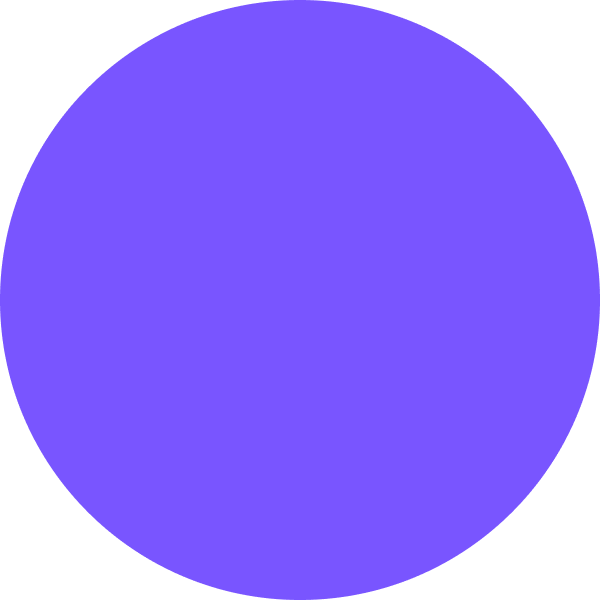

# Colors

### Brand Color

#### Platform of Trust purple  

* **HEX**: \#7955FF
* **RGB**: 121 / 85 / 255
* **CMYK**: 53 / 67 / 0 / 0

### Platform of Trust blue tones

#### Primary blue **** 

* **HEX:** \#1E1540
* **RGB:** 30 / 21 / 64
* **CMYK:** 13 / 17 / 0 / 75

#### Secondary blue  

* **HEX**: \#2ABFF0
* **RGB**: 42 / 191 / 240
* **CMYK**: 78 / 19 / 0 / 6

#### Light blue   

* **HEX**: \#EAF5FF
* **RGB**: 234 / 245 / 255
* **CMYK**: 8 / 4 / 0 / 0

### Platform of Trust additional colors

#### Platform of Trust green  

* **HEX**: 5ECE60
* **RGB**: 94 / 206 / 96
* **CMYK**: 44 / 0 / 43 / 19

#### Platform of Trust pink  

* **HEX**: FFB2CA
* **RGB**: 255 / 178 / 202
* **CMYK**: 0 / 30 / 21 / 0

