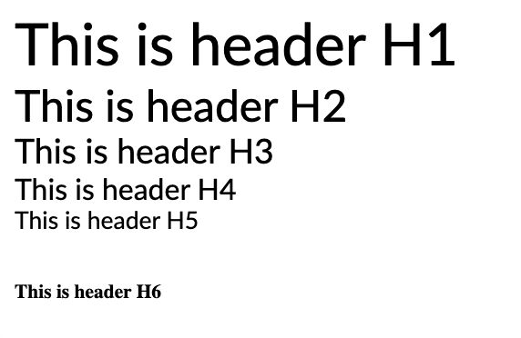

# Typography

### Headers



```text
h1, h2, h3, h4, h5, p, ul {
    padding: 0;
    margin: 0;
    font-weight: 400;
    font-family: "Lato", sans-serif;
}
```

`Header H1` is used across websites as main titles of **list pages** and **single pages**.

For list pages, `H1` is accompanied by classes `.base-main-title` and `.main-title`

```text
<h1 class="base-main-title main-title">We harmonize all kinds of odd data</h1>

 .base-main-title {
        margin-top: 120px;
        padding-right: 50px;
    }
 .main-title {
        font-size: 56px;
        width: 100%;
    }
 
```

For single pages, `H1` is accompanied by class `.single-page-main-title`

```text
<h1 class="single-page-main-title">Data Products</h1>

.single-page-main-title, .main-title {
        font-size: 56px;
        padding-bottom: 24px;
        margin-top: 0px;
    }

```

